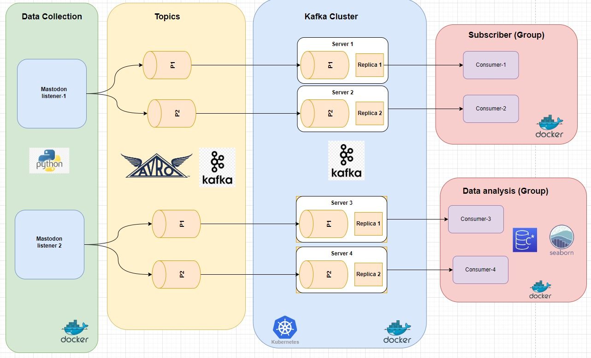

# Streaming Framework
A networking framework to receive public posts from one or more Mastodon user accounts and publish the posts onto different channels in near realtime. It also provides data pipelines to perform data analysis of the user activity based on the recceived posts.

# Software Design Phase

## Phase-1: Proof of concept
 - Simple monolith software architecure capable of
   - receiving posts from a single Mastodon account
   - publish the post on a given account
  
## Phase-2: MVP (minimum viable product)
 - Single system modular monolithic implementation with Kafka
 - Contains only one producer
 - Two consumer groups
   - each group contains one consumer

## Phase-3: Scalable software architecture

```Work In Progress!!!```

Expected to fulfill the following functional requirements:
 - Receives posts from different user accounts
 - Provides different types of output channels for 
   - publishing received posts
   - publishing different user stats




# Installation and Executing the Application

## Setup Python Environment
Install the required python packages using the following command:
```console
source env/bin/activate (optional)
pip install --upgrade pip
pip install -r requirements.txt
 ```

## Executing Streaming Application
The python `streaming_app` application listens for public posts to the specified server, and sends each toot to Kafka.
Currently it is hard-coded to a user-account defined inside the `streaming_app.py` script.

```console
python streaming_app.py --baseURL https://mastodon.social

or the following command to run with kafka support:
python streaming_app.py --baseURL https://mastodon.social --enableKafka
```

## Executing Data Processing Platform
This platform uses Kafka as a distributed stream processing platform to collect data from multiple instances.
This unit is using the following additional tools:
 - Kafka Connect (with the S3 sink connector)
 - schema registry (to support AVRO serialisation)
 - MinIO setup containers with this command
 - Docker to run different services inside containers

NOTE: However, this section `WORK IN PROGRESS`

Use the following command to start the service-containers:
```console
 docker-compose up -d
 ```